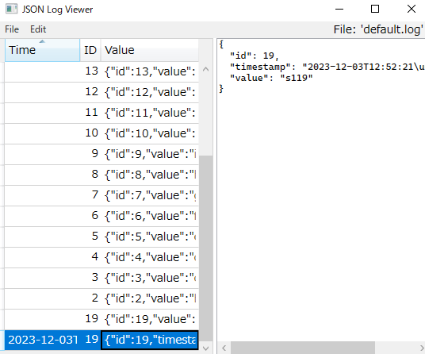

# JSON Log Viewer

Simple GUI JSON log file viewer.

## Features

- Open log file
- Keep reading it like `tail -f` (periodically)

## Log Format

Each line must be a valid JSON string.

`id`, `timestamp` properties are extracted into columns (optional).
